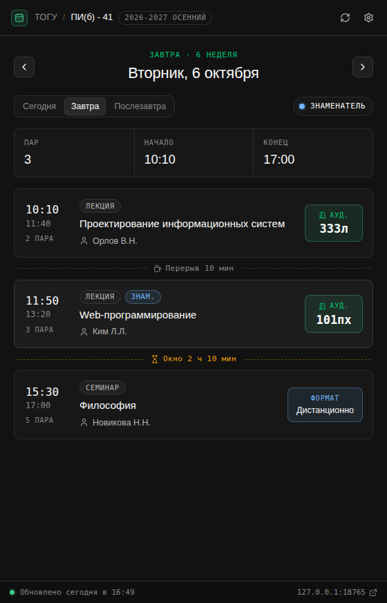
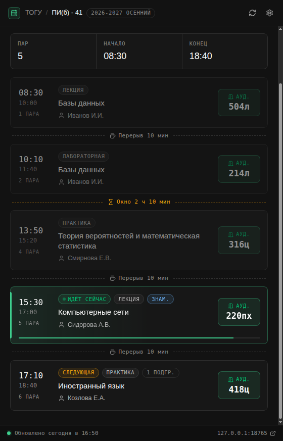
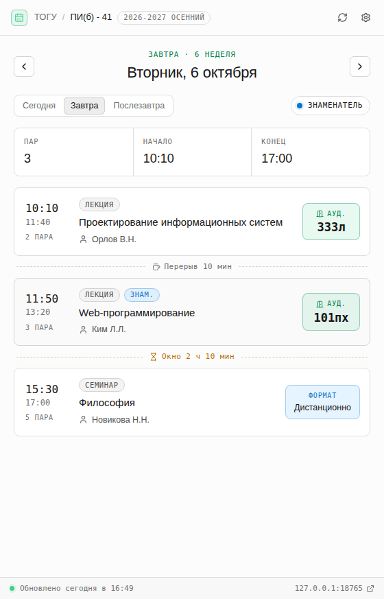

# Расписание ТОГУ — пары на завтра

Десктопное приложение для macOS: показывает, какие пары у группы **завтра** (или в любой другой день), **в какое время** и **в какой аудитории**, с учётом **числителя и знаменателя**. Данные берутся со страницы группы на [togudv.ru/rasp](https://togudv.ru/rasp/groups/69092/?semester_id=33). Оформление — в стилистике Supabase.

| Завтра (тёмная тема) | Сегодня: идёт пара | Светлая тема |
|---|---|---|
|  |  |  |

<sub>На скриншотах демо-данные.</sub>

## Что умеет

- По умолчанию открывает **завтрашний день**; стрелки `←` `→` или кнопки «Сегодня / Завтра / Послезавтра» листают дни.
- Для каждой пары: время начала и конца, номер пары, дисциплина, вид занятия, преподаватель и крупно — **аудитория**.
- Определяет **числитель/знаменатель** и показывает только пары нужной недели. Пары «только по числителю/знаменателю» помечены бейджами.
- Показывает перерывы и «окна» между парами, сегодня — какая пара идёт сейчас и сколько осталось.
- Фильтр по **подгруппе**.
- Работает **без интернета**: последнее загруженное расписание сохраняется. Автообновление при запуске и раз в 2 часа.
- Тёмная, светлая или системная тема.

## Установка

### Вариант 1. Готовая сборка

1. Откройте вкладку **Actions** репозитория → последний успешный запуск «Сборка для macOS» → скачайте артефакт `togu-raspisanie-mac` (или возьмите файл из **Releases**, если есть релиз).
2. Выберите файл под ваш Mac: `…-arm64.dmg` — для Apple Silicon (M1–M4), `…-x64.dmg` — для Intel.
3. Перетащите «Расписание ТОГУ» в «Программы».
4. Приложение не подписано сертификатом Apple, поэтому при первом запуске: правый клик по приложению → **Открыть** → **Открыть**. Если macOS пишет, что приложение «повреждено», выполните в Терминале:
   ```bash
   xattr -dr com.apple.quarantine "/Applications/Расписание ТОГУ.app"
   ```

### Вариант 2. Из исходников

Нужен [Node.js](https://nodejs.org) 20+.

```bash
git clone https://github.com/roskone/inform_togu.git
cd inform_togu
npm install
npm start            # запустить приложение
npm run dist:mac     # собрать .dmg и .zip в папку dist/
```

## Настройка

Настройки — по кнопке-шестерёнке или `⌘,`:

- **Ссылка на расписание** — страница группы на `togudv.ru/rasp/groups/…`. Когда начнётся новый семестр, выберите его на сайте и вставьте новую ссылку (меняется `semester_id`).
- **Подгруппа** — скрывает пары другой подгруппы.
- **Текущая неделя** — «Авто» или вручную.
- **Тема**.

### Как определяется числитель/знаменатель

По порядку приоритета:

1. **Вручную** — если в настройках выбрано «Числитель» или «Знаменатель» (выбор относится к текущей неделе, дальше недели чередуются).
2. **По данным сайта** — подсказка на странице группы («сейчас идёт … неделя») или страница [«Расписание недель и звонков»](https://togudv.ru/rasp/weektypes/).
3. **По правилу ТОГУ** — числитель это нечётная неделя, считая от недели с 1 сентября, знаменатель — чётная.

Какой источник использован, видно при наведении на бейдж недели.

## Если что-то не так

- **«Не удалось загрузить расписание»** — сайт ТОГУ часто недоступен из-за рубежа: отключите VPN и нажмите «Повторить» (`⌘R`).
- **Пары разобраны неверно** — откройте «Диагностика разбора» (`⌘⇧D` или в настройках). Там видно все найденные занятия. Кнопка «Сохранить HTML…» сохраняет страницу и результат разбора — пришлите их, чтобы поправить парсер под вёрстку сайта.

## Как это устроено

- `src/main.js` — процесс Electron: окно, меню, загрузка страниц через сетевой стек Chromium (учитывает системный прокси), кэш и настройки в `~/Library/Application Support/Расписание ТОГУ/`. Если сайт отдаёт защитную JS-страницу, расписание читается из скрытого окна браузера.
- `src/renderer/lib/parser.js` — парсер страницы. Не привязан к конкретным CSS-классам и понимает несколько раскладок: таблица «строка — занятие» (с колонкой Ч/З, `rowspan`), сетка «пары × дни», секции «Неделя по числителю/знаменателю» и вёрстка без таблиц. Пометку недели берёт из текста (Ч/З, «числитель»), из классов и цвета ячеек (на сайте числитель — розовый, знаменатель — синий). Если на странице есть фильтры «Неделя по числителю/знаменателю», загружаются обе версии и сравниваются.
- `src/renderer/lib/weeks.js` — даты, чётность недель, выборка пар на день.
- `src/renderer/app.js`, `styles.css` — интерфейс.

Тесты парсера: `npm test`.
